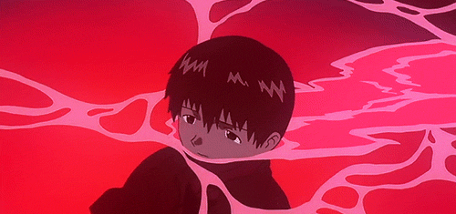

# Sobre mim

- Graduando em Ciência da Computação pela UFPR (ano de ingresso: 2024).
- Aluno de Iniciação Científica em Visão Computacional e Reconhecimento Facial, orientado pelo professor Dr. David Menotti.
- Coordenador do Nível 3 do POTI/UFPR ([poti.ufpr.br](https://poti.ufpr.br/)), professor de Combinatória.
- Membro do Capimara UFPR, grupo para competidores de Maratona de Programação.
- Vice-presidente do CAAD (Centro Acadêmico Alexandre Direne).

## Curiosidades sobre mim

- 🥇 OPRM 2023
- 🥇 OBMEP 2023 (regional)
- 🥈 OBMEP 2023 (nacional)
- Professor de Combinatória do POTI/UFPR nos anos de 2024, 2025 e 2026.
- Aluno da **Turma Honors** de Cálculo 1 (2024/1) e Cálculo 2 (2024/2).
- Monitor de Cálculo 2 em 2025/1 e 2025/2.
- Ex-membro da empresa júnior **Ecomp**.
- Jogo favorito: Megaman X4.
- Anime favorito: Evangelion.
- Comida favorita: Sushi.

## Tecnologias e Ferramentas

  

## Contato

---

