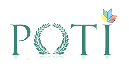
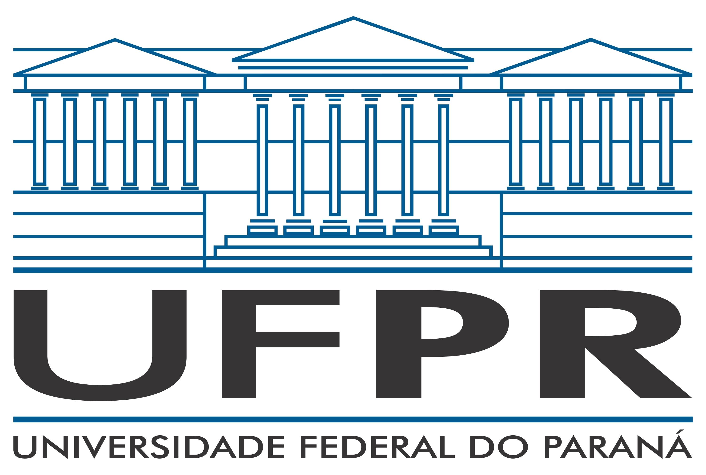
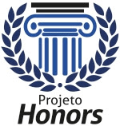
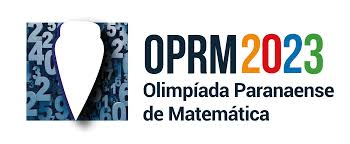
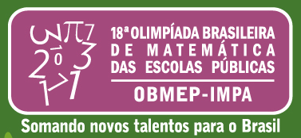

# 👋 Olá! Eu sou o Gregorio

💻 Estudante de Ciência da Computação na UFPR  
🧑‍🔬 Aluno de Iniciação Científica do laboratório VRI, estudos em Visão Computacional, Processamento de Imagem e Reconhecimento Facial
👨‍🏫 Professor de Combinatória N3 no POTI/UFPR (2024-2025)  

## 🏫 Instituições e Projetos  

  
  

## 🚀 Curiosidades sobre mim  
- 🥇 OPRM2023  
- 🥇 OBMEP2023 (regional)  
- 🥈 OBMEP2023 (nacional)  
- Aluno da **Turma Honors** de Cálculo 1 e Cálculo 2  
- Ex-membro da empresa júnior **Ecomp**
  

  
  
  

## 🔧 Tecnologias e Ferramentas
 

## 📫 Contato  

📧 Email: vgfucci@hotmail.com  

---

⭐️ *Seja bem-vindo ao meu perfil!*  
